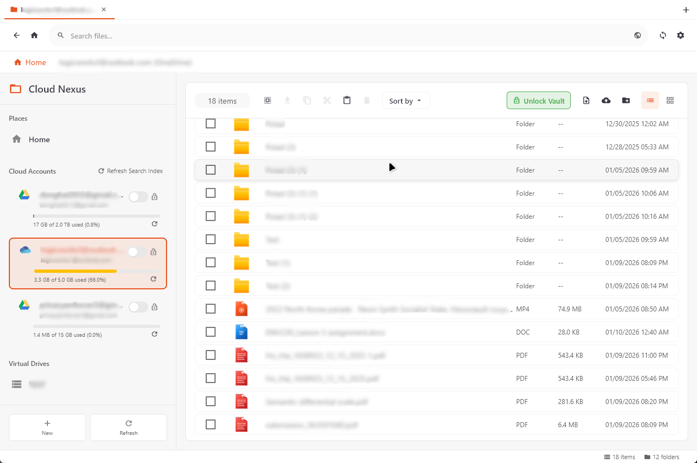

# Cloud Nexus

Welcome to Cloud Nexus - your personal, secure cloud storage management hub. This application brings all your cloud storage services together in one beautiful, unified interface with powerful encryption capabilities.

## Features

### End-to-End Encryption
- Encrypt your files before they ever leave your device
- Military-grade encryption keeps your data safe and private
- Your encryption keys belong only to you

### Multi-Cloud Integration
- Google Drive - Seamlessly connect and manage your Google Drive
- OneDrive - Full integration with Microsoft OneDrive
- More providers coming soon!

### Unified File Management
- Browse all your cloud storage in one place
- Drag and drop files between different cloud services
- Create virtual drives for organized storage management
- Intelligent file synchronization across services

### Powerful Features
- Real-time Progress Tracking - Watch your uploads and downloads in real-time
- Batch Operations - Upload, download, or move multiple files at once
- File Preview - Quick preview of your files without downloading
- Smart Search - Find your files instantly across all connected services
- Streaming Encryption - Encrypt files on the fly for faster processing
- Task Management - Monitor and manage all your transfer tasks

### Beautiful Interface
- Clean, modern design that's easy on the eyes
- Dark mode support
- Intuitive navigation with sidebar and tab system
- Visual storage quota indicators
- Customizable file icons

## Demo

Here's a preview of what Cloud Nexus looks like:



## Running on Windows

### Prerequisites
Before you get started, make sure you have these installed on your Windows machine:

1. **Flutter SDK** (version 3.0 or higher)
   - Download from flutter.dev/docs/get-started/install/windows
   - Make sure to add Flutter to your PATH

2. **Git** (optional, for cloning)
   - Download from git-scm.com/download/win

3. **Visual Studio** (with C++ desktop development workload)
   - Required for building Windows applications
   - Download from visualstudio.microsoft.com/downloads/

### Getting Started

1. **Clone or Download the Project**
   ```bash
   git clone <your-repository-url>
   cd cloud_nexus
   ```

2. **Install Dependencies**
   ```bash
   flutter pub get
   ```

3. **Build the Native Library**
   ```bash
   build_native.bat
   ```
   This script compiles the Rust-based encryption library.

4. **Set Up Your Environment**
   - Copy `.env.example` to `.env`:
   ```bash
   copy .env.example .env
   ```
   - Open `.env` and add your API credentials:
     ```
     GOOGLE_CLIENT_ID=your-google-client-id
     GOOGLE_CLIENT_SECRET=your-google-client-secret
     ONEDRIVE_CLIENT_ID=your-onedrive-client-id
     ONEDRIVE_CLIENT_SECRET=your-onedrive-client-secret
     ```

5. **Run the Application**
   ```bash
   flutter run -d windows
   ```

   Or if you want to build an executable:
   ```bash
   flutter build windows
   ```

### Troubleshooting

**"flutter: command not found"**
- Make sure Flutter is added to your system PATH
- Restart your terminal/command prompt after installation

**Build Errors**
- Ensure Visual Studio with C++ workload is installed
- Run `flutter doctor` to check for any issues
- Make sure all dependencies are installed with `flutter pub get`

**Encryption Library Issues**
- Make sure you've run `build_native.bat`
- Check that Rust is installed if you're modifying the native code

## Platform Support

| Platform | Status |
|----------|--------|
| Windows | Fully Supported |
| Linux | Coming Soon |
| macOS | Coming Soon |
| Android | Coming Soon |
| iOS | Coming Soon |

## API Setup

### Google Drive
1. Go to console.cloud.google.com
2. Create a new project
3. Enable Google Drive API
4. Create OAuth 2.0 credentials (Desktop application)
5. Copy your Client ID and Secret to `.env`

### OneDrive
1. Go to portal.azure.com
2. Register a new application
3. Add Delegated permissions for Files.ReadWrite
4. Copy your Application (client) ID and client secret to `.env`

## Technology Stack

- Flutter - Cross-platform UI framework
- Dart - Programming language
- Rust - High-performance encryption and file operations
- Provider - State management
- Hive - Local data storage

## License

This project is licensed under the MIT License - see the LICENSE file for details.

## Contributing

Contributions are welcome! Feel free to open issues or submit pull requests.

## Support

If you run into any issues or have questions, please open an issue on GitHub.